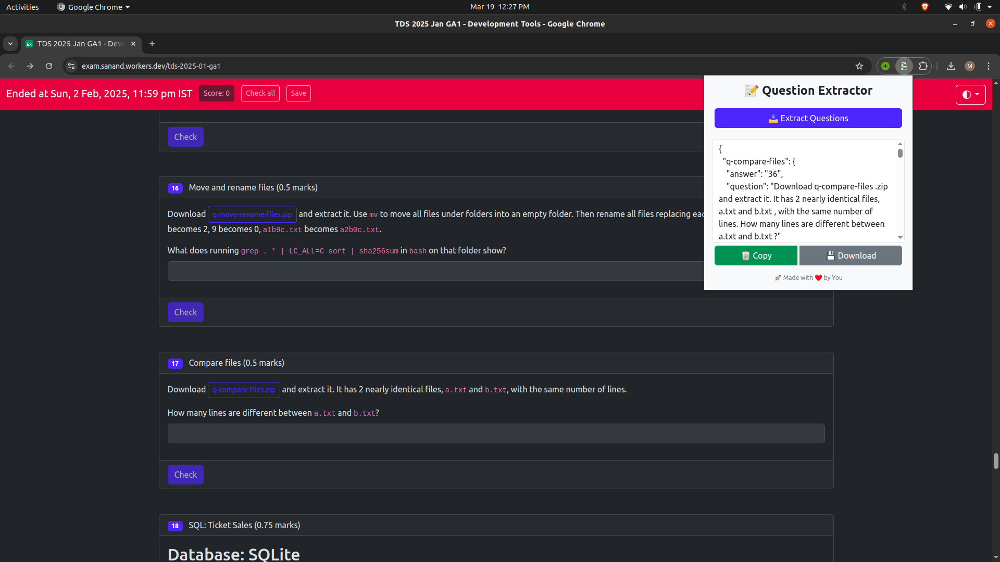

# TDS Exam Question Extractor

# Steps to install

1. go to chrome://extensions
2. make sure **Developer mode** is enabled
3. click on **Load unpacked**
4. select the folder **chrome-extension** in the cloned this repo
5. click on Add extension

# Steps to use

1. go to assignment page
2. click on the extension icon
3. click on extract questions
4. copy / download the extracted questions json

# Screenshots

